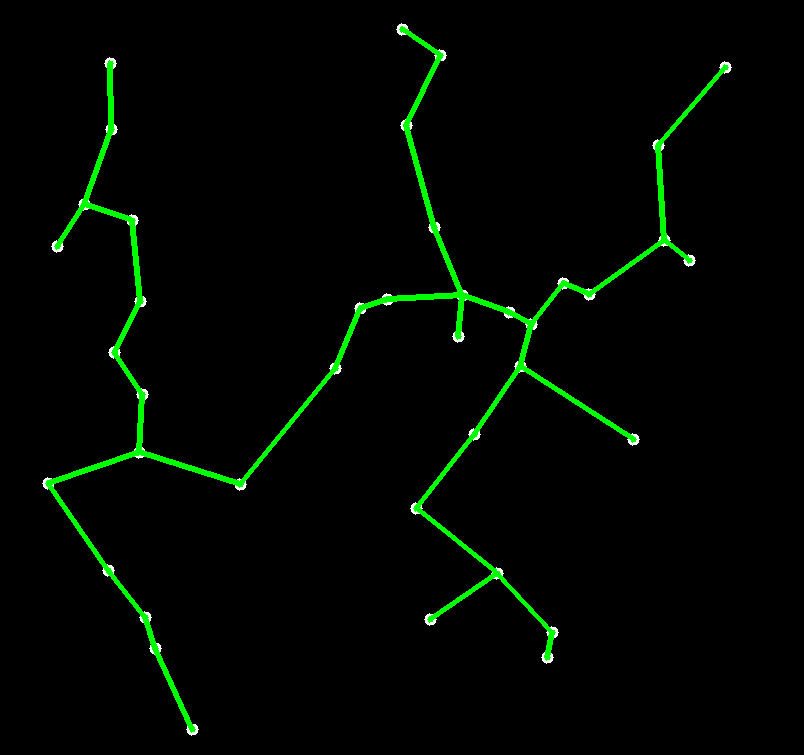

<h1>Kruskal's Algorithm</h1>
Finds the minimum spanning tree of a weighted graph

<h4>Installation:</h4>
make to compile 
./kruskal to run 

<h4>Controls:</h4>
N to iterate algorithm manually 
SPACE to toggle pause 
Mouse1 to move coordinate system 
Mouse1 on a point to move point 
Mouse2 to display coordinates of mouse pointer 
Scroll Wheel to zoom 

<h4>Dependencies:</h4>
sdl
 
 
 

